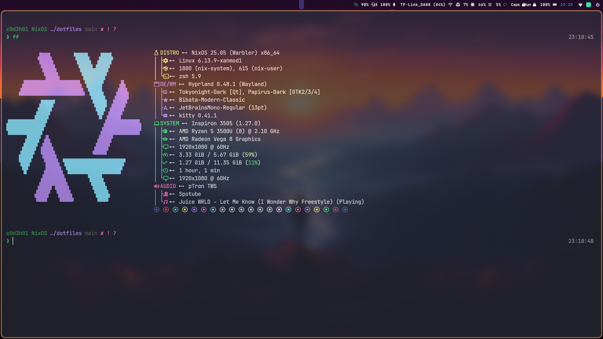

<!-- <div align="center">
  
</div> -->

## Overview

- This repository contains my personal NixOS configurations and dotfiles.

## Repository Structure

```
.
├── assets/         # Images and other assets
├── hosts/          # Host-specific configurations
│   ├── desktop/    # Desktop machine configuration
│   ├── laptop/     # Laptop configuration
│   └── common.nix  # Shared configuration between hosts
├── modules/        # Modular configuration components
│   ├── home-manager/  # Home-manager configurations
│   └── nixos/      # NixOS-specific modules
├── overlays/       # Custom package overlays
├── scripts/        # Utility scripts
└── flake.nix       # Main Nix flake configuration
```    

> [!CAUTION]  
> These host system and home configurations are published for educational and research purposes only. They are specifically tailored for my hardware and should not be used directly on other systems. Attempting to build and deploy these configurations to other systems without appropriate modifications can lead to unbootable machines and data loss.

> [!NOTE]  
> I intentionally do not provide copy/pastable commands for building, switching, or installing any of these configurations given the risks mentioned above.

## Contributing

Contributions, suggestions, and improvements are welcome. Please feel free to:

- Open issues for bugs or suggestions
- Submit pull requests with improvements
- Share ideas for better organization or new features
